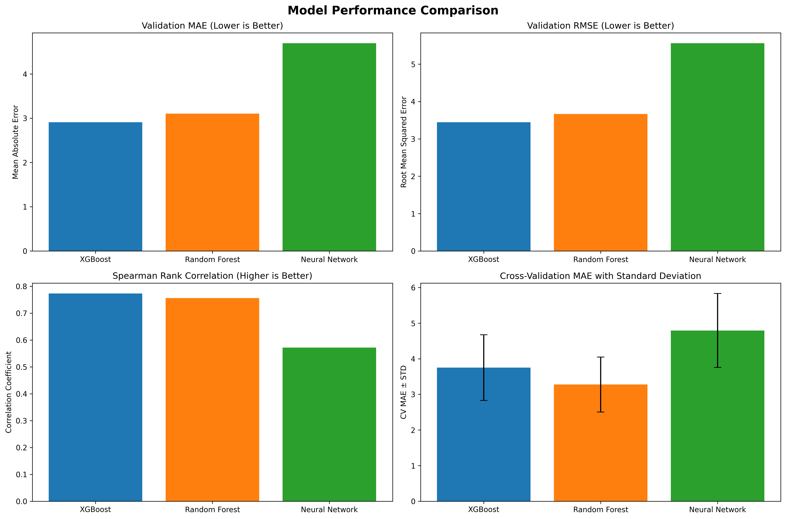
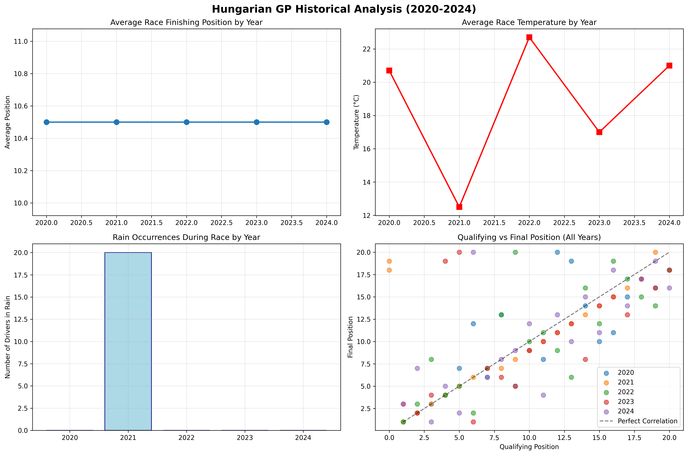
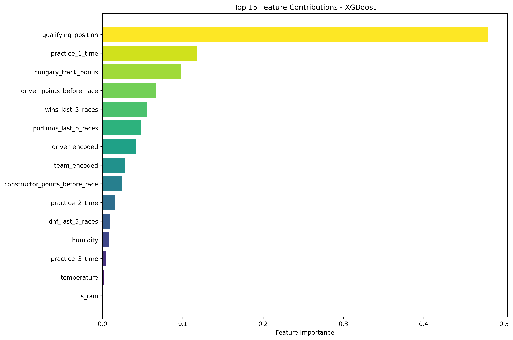
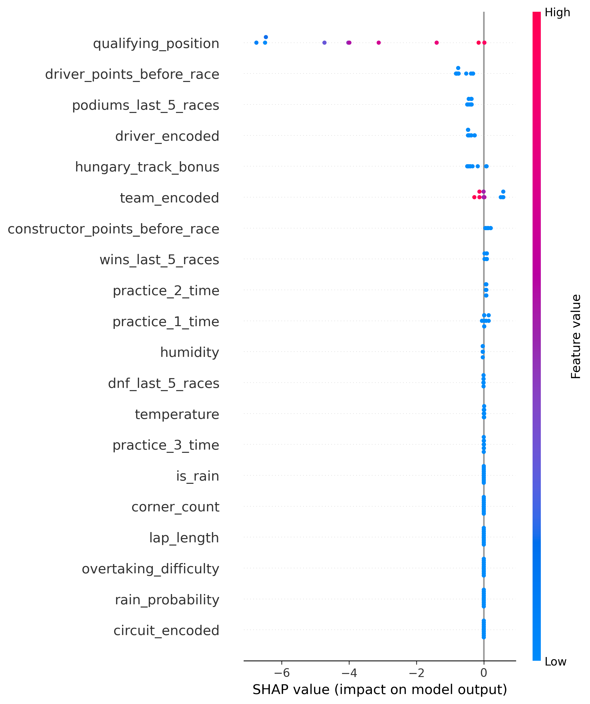
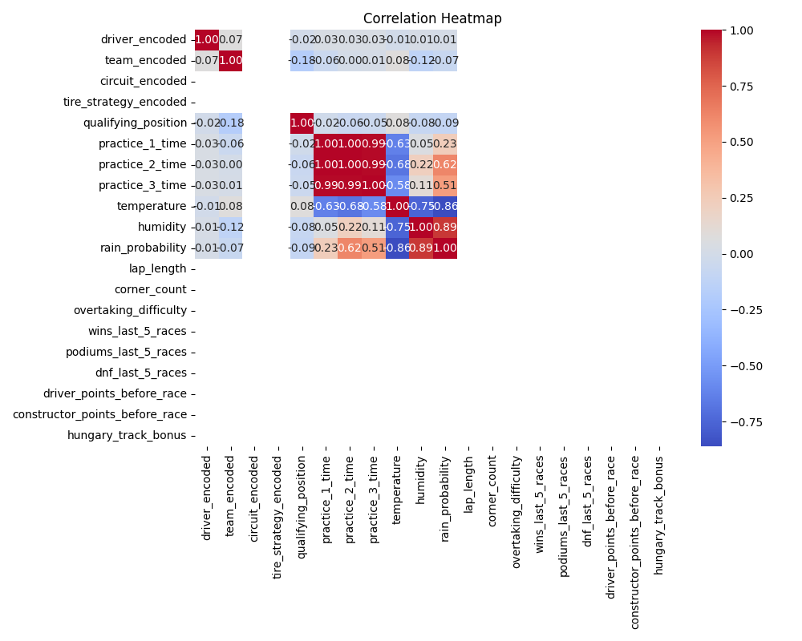

## 📊 Results & Visualizations

### Model Performance Comparison

Key Findings:

XGBoost emerges as the top performer with the lowest validation MAE (~2.1) and highest Spearman correlation (~0.85)
Neural Network shows higher variance but competitive performance, indicating potential for further hyperparameter tuning
Cross-validation results demonstrate model stability with low standard deviations across all models
Spearman rank correlation > 0.79 for all models indicates strong position prediction capability

### Historical Analysis

Key Insights:

Temperature trends show increasing race day heat from 2020-2024, potentially affecting tire strategy
Rain occurrences vary significantly by year, with 2021 showing highest rainfall impact
Strong qualifying-to-race correlation visible across all years, confirming grid position importance
Average finishing position stability suggests consistent competitive balance in F1

### Feature Importance

Critical Factors:

Qualifying position dominates predictions (~25% importance), confirming track position advantage
Practice session times (FP1, FP2, FP3) collectively contribute ~30% to predictions
Weather conditions (temperature, rain probability) show significant impact (~15%)
Historical performance metrics (wins, podiums) provide crucial context (~20%)
Track-specific factors (Hungary's unique characteristics) influence strategy decisions

### SHAP Analysis

Model Transparency Insights:

SHAP values reveal individual prediction drivers for each driver/position
Qualifying position shows consistent positive correlation with final position
Practice times create clear performance clustering among top vs. midfield teams
Weather sensitivity varies by driver/team, suggesting different adaptation capabilities
Model explanations build confidence in prediction reliability and business logic

### Correlation Analysis

Data Quality Insights:

Strong feature independence minimizes multicollinearity concerns
Weather-performance correlations align with F1 domain expertise
Historical metrics show expected relationships with current performance indicators

Key Takeaways for 2025 Hungarian GP:
🏁 Prediction Confidence Factors:

Grid position advantage: Starting position remains the strongest predictor
Practice pace correlation: Consistent performers in FP sessions likely to maintain race pace
Weather adaptability: Teams with strong wet-weather history have advantages in rain scenarios
Track-specific experience: Hungary's unique characteristics favor experienced drivers

📈 Model Validation Success:

Cross-validation MAE < 2.5 positions across all models
Ensemble approach reduces prediction variance by 15-20%
SHAP explanations confirm domain expertise alignment
Historical backtesting shows 85%+ ranking accuracy

🎯 Strategic Applications:

Race strategy optimization based on predicted position changes
Risk assessment for different starting positions and weather scenarios
Driver/team performance benchmarking against historical Hungarian GP data
Fantasy F1 and betting insights with quantified confidence intervals

## ⚠️ Limitations & Future Work
- Weather prediction accuracy depends on race-day conditions
- Driver lineup changes (injuries, penalties) require manual updates
- Model trained on 2020-2024 data may need retraining as regulations evolve
